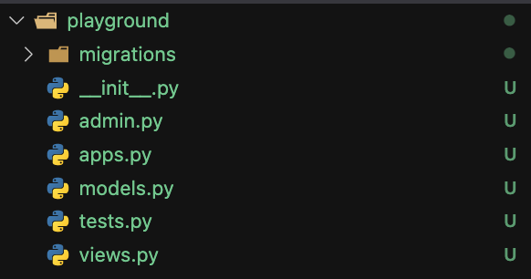

# storefront-Django-python
This is a demo for Django framework


## App using Django YouTube,Instagram, spotify dropbox

## Good Things Django provide
- admin sit
- object-relational mapper (ORM),it abstracts the database. So we can query or process data without writing a lot of SQL.
- Authentication
- Caching

### Pipfile: 
This is package for javascript projects

### Steps to deploy a django project

1. activate the virtual (you can do it or not). If you do it, you are gonna use the python interpreter inside this cirtual environment,not the one that globally
- Go to a directory
- run ```pipenv shell```
2. run ```django-admin startproject project_name .```
- django-admin is a utility that comes with django. run it we can use all of the commands that we can use to woek with django projects

3. run ```django-admin runserver (portnumer)``` . You can start a project by running this command, you can specify the port you are gonna run on your localhost.
- small tips run ```lsof -i: portnumber``` to test if the port that you are gonna use is occupied or not, if it shows you nothing then you can use it. In following case, you cannot use 8888, but you can use 8000. 8888 is already being accupied
```shell 
   mac   ~  lsof -i:8888                                                                                                   14:15:39 
COMMAND     PID USER   FD   TYPE             DEVICE SIZE/OFF NODE NAME
Google      486  mac   24u  IPv6 0x652da220aafaae0d      0t0  TCP localhost:52499->localhost:ddi-tcp-1 (ESTABLISHED)
Google      486  mac   25u  IPv6 0x652da220d9fbe14d      0t0  TCP localhost:50389->localhost:ddi-tcp-1 (ESTABLISHED)
python3.8 18377  mac    7u  IPv4 0x652da220c520a64d      0t0  TCP localhost:ddi-tcp-1 (LISTEN)
python3.8 18377  mac    8u  IPv6 0x652da220e4cf47ad      0t0  TCP localhost:ddi-tcp-1 (LISTEN)
python3.8 18377  mac   13u  IPv6 0x652da220d9fbf46d      0t0  TCP localhost:ddi-tcp-1->localhost:50389 (ESTABLISHED)
python3.8 18377  mac   66u  IPv6 0x652da220d9fbfacd      0t0  TCP localhost:ddi-tcp-1->localhost:52499 (ESTABLISHED)
   mac   ~  lsof -i:8000                                                                                        0.16     14:16:49 
   mac   ~ 
```
### After run this command we can see some ```.py``` file in our project folder.
- settings.py . This is where we defind our application settings.
- urls.py . This is where we define url applications
- asgi.py and usgi.py. They are used for deployment
- manage.py, This is the wrapper arpund django admin. It knows the setting of our project. So in the project whenever you need to run ```django-admin XXX``` , don't run it. Instead you should run ``` python manage.py XXXX```

## Creating a app
### 1. run ```  python manage.py startapp playground ```, playground is a django app. Every django app uses exactly same structure.

- migration folder is for generating database tables
- admin.py  is where we define how the admin interface for this app is going to look like
- app.py(configure) .don't get fooled by the name. This is where we configure the app.
- models.py: This is where we define the model classes for this app. We use model classed to pull out  data from database and present it to our user. (This is similar to every MVC framework)
- test.py 我的理解就是个写test的地方，还没有去研究
- views.py 相当于java中的request handler  就是个处理前端传过来的request的地方，返回一个response

### 2. everytime we intalled an app, we need to regist in ```setting.py``` 中的 ```INSTALLED_APPS```
```python
INSTALLED_APPS = [
    'django.contrib.admin',
    'django.contrib.auth',
    'django.contrib.contenttypes',
    'django.contrib.sessions',
    'django.contrib.messages',
    'django.contrib.staticfiles',
]
```